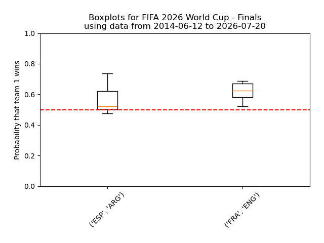
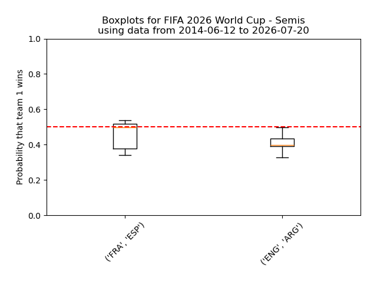
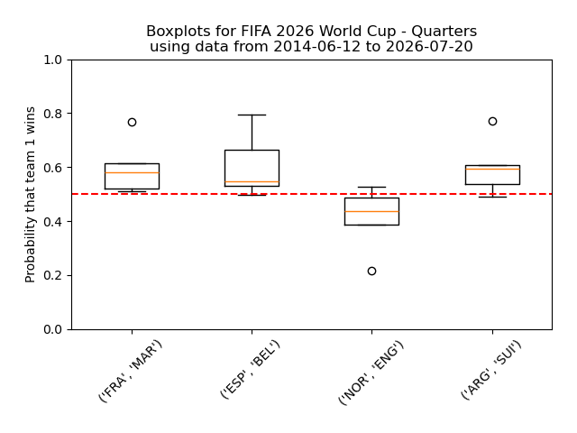
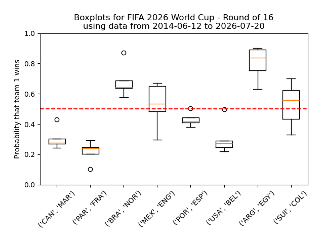
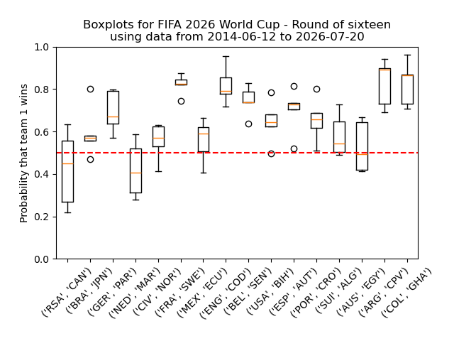
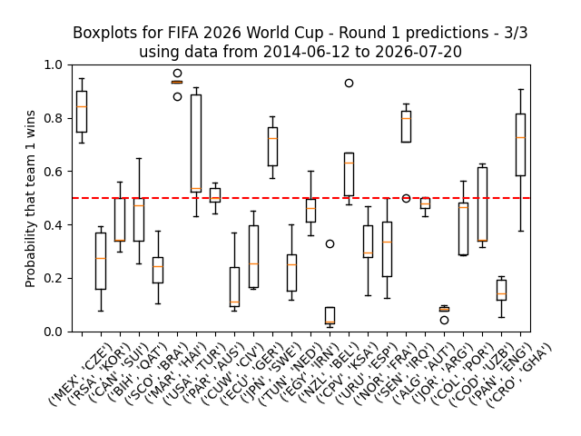
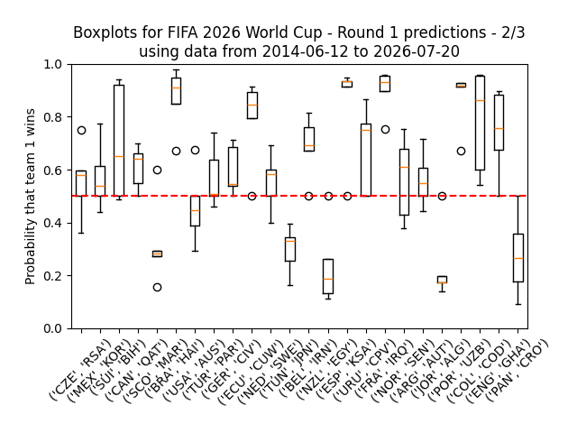
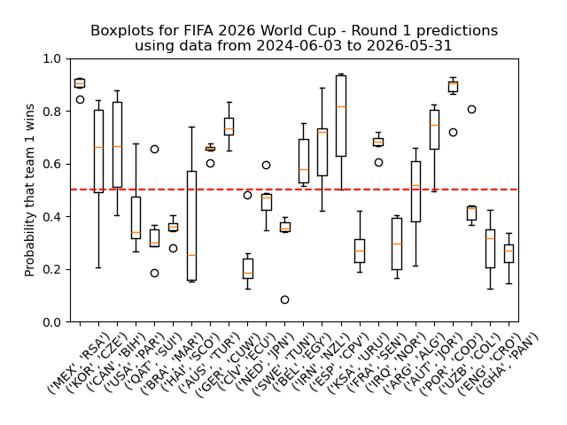

# FIFA World Cup 2026

Simple pronostics for FIFA 2026 football World Cup based on Bradley-Terry and some past data. 
See also https://github.com/jbudynek/rugby2023 and https://github.com/jbudynek/uefa2024

## HOWTO Initialize

The data comes from this great repo that has results for all soccer games ever!
https://github.com/martj42/international_results/

- Get source data with `wget https://github.com/martj42/international_results/raw/refs/heads/master/results.csv -O input_data/results.csv`
- Run `00_process_data.py` (adapt if necessary)
- in `conf.py`
    - update all teams short and all teams long (get list from `00_process_data.py`)
    - update `BOUNDS` (6 months increments, or something that makes more sense)
- in `01_make_games_list.py`
    - update the code to read the two new files (see line 5) and create the games list

## HOWTO run each round

- Update source data with `wget https://github.com/martj42/international_results/raw/refs/heads/master/results.csv -O input_data/results.csv`
- or, in `input_data\wc_games_results_during_fifa26.csv`
    - update file with games and results since competition started
- in `conf.py`
    - update `ALL_GAMES` with the games you want a pronostic for, and `TITLE` with the title you want for the graph that will be generated
    - update `BOUNDS`

Then:
- Run `00_process_data.py` (if you updated the source data)
- Run `01_make_games_list.py`
- Run `02_bradley_terry.py`
- Run `03_pronostics_from_bt.py`
- See in the terminal for easy to read pronostics, and see in `boxplots/` for a nice graph.

## Finals

## Semis

## Quarters

## Round of 16 results

| Match | My Prono | Real Winner | Result |
| :--- | :--- | :--- | :---: |
| **Canada vs Maroc** | Maroc | **Maroc** (0-3) | ✅ |
| **Paraguay vs France** | France | **France** (0-1) | ✅ |
| **Brésil vs Norvège** | Brésil | **Norvège** (1-2) | ❌ |
| **Mexique vs Angleterre** | Mexique | **Angleterre** (2-3) | ❌ |
| **Portugal vs Espagne** | Espagne | **Espagne** (0-1) | ✅ |
| **États-Unis vs Belgique** | Belgique | **Belgique** (1-4) | ✅ |
| **Argentine vs Égypte** | Argentine | **Argentine** (3-2) | ✅ |
| **Suisse vs Colombie** | Suisse | **Suisse** (0-0) | ✅ |

**TOTAL : 6 right pronostics out of 8 so 75%**

**GRAND TOTAL : 60 right pronostics out of 96 so ~63%**

## Round of 16

## Round of 32 results

| Match | My Prono | Real Winner | Result |
| :--- | :--- | :--- | :---: |
| **Afrique du Sud vs Canada** | Canada | **Canada** (0-1) | ✅ |
| **Brésil vs Japon** | Brésil | **Brésil** (2-1) | ✅ |
| **Allemagne vs Paraguay** | Allemagne | **Paraguay** (1-1) | ❌ |
| **Pays-Bas vs Maroc** | Maroc | **Maroc** (1-1) | ✅ |
| **Côte d’Ivoire vs Norvège** | Côte d’Ivoire | **Norvège** (1-2) | ❌ |
| **France vs Suède** | France | **France** (3-0) | ✅ |
| **Mexique vs Équateur** | Mexique | **Mexique** (2-0) | ✅ |
| **Angleterre vs RD Congo** | Angleterre | **Angleterre** (2-1) | ✅ |
| **Belgique vs Sénégal** | Belgique | **Belgique** (3-2) | ✅ |
| **États-Unis vs Bosnie** | États-Unis | **États-Unis** (2-0) | ✅ |
| **Espagne vs Autriche** | Espagne | **Espagne** (3-0) | ✅ |
| **Portugal vs Croatie** | Portugal | **Portugal** (2-1) | ✅ |
| **Suisse vs Algérie** | Suisse | **Suisse** (2-0) | ✅ |
| **Australie vs Égypte** | Australie | **Egypte** (1-1) | ❌ |
| **Argentine vs Cap-Vert** | Argentine | **Argentine** (3-2) | ✅ |
| **Colombie vs Ghana** | Colombie | **Colombie** (1-0) | ✅ |

**TOTAL : 13 right pronostics out of 16 so ~81%**

**GRAND TOTAL : 54 right pronostics out of 88 so ~61%**

## Round of 32

## Pool games results

| Game | My Prono | Real winner | Score | Y/N |
| :--- | :--- | :--- | :--- | :--- |
| **Round 1** | | | | |
| Mexico - South Africa | **MEX** | Mexico | 2-0 | ✅ |
| South Korea - Czech Rep | **KOR** | South Korea | 2-1 | ✅ |
| Canada - Bosnia | **CAN** | Draw | 1-1 | ❌ |
| USA - Paraguay | **PAR** | USA | 4-1 | ❌ |
| Qatar - Switzerland | **SUI** | Draw | 1-1 | ❌ |
| Brazil - Morocco | **MAR** | Draw | 1-1 | ❌ |
| Haiti - Scotland | **SCO** | Scotland | 0-1 | ✅ |
| Australia - Turkey | **AUS** | Australia | 2-0 | ✅ |
| Germany - Curaçao | **GER** | Germany | 7-1 | ✅ |
| Ivory Coast - Ecuador | **ECU** | Ivory Coast | 1-0 | ❌ |
| Netherlands - Japan | **JPN** | Draw | 2-2 | ❌ |
| Sweden - Tunisia | **TUN** | Sweden | 5-1 | ❌ |
| Belgium - Egypt | **BEL** | Draw | 1-1 | ❌ |
| Iran - New Zealand | **IRN** | Draw | 2-2 | ❌ |
| Spain - Cape Verde | **ESP** | Draw | 0-0 | ❌ |
| Saudi Arabia - Uruguay | **URU** | Draw | 1-1 | ❌ |
| France - Senegal | **FRA** | France | 3-1 | ✅ |
| Iraq - Norway | **NOR** | Norway | 1-4 | ✅ |
| Argentina - Algeria | **ALG** | Argentina | 3-0 | ❌ |
| Austria - Jordan | **AUT** | Austria | 3-1 | ✅ |
| Portugal - DR Congo | **POR** | Draw | 1-1 | ❌ |
| Uzbekistan - Colombia | **COL** | Colombia | 1-3 | ✅ |
| England - Croatia | **CRO** | England | 4-2 | ❌ |
| Ghana - Panama | **PAN** | Ghana | 1-0 | ❌ |
| **Round 2** | | | | |
| Czech Rep - South Africa | **CZE** | Draw | 1-1 | ❌ |
| Mexico - South Korea | **MEX** | Mexico | 1-0 | ✅ |
| Switzerland - Bosnia | **SUI** | Switzerland | 4-1 | ✅ |
| Canada - Qatar | **CAN** | Canada | 6-0 | ✅ |
| Scotland - Morocco | **MAR** | Morocco | 0-1 | ✅ |
| Brazil - Haiti | **BRA** | Brazil | 3-0 | ✅ |
| USA - Australia | **AUS** | USA | 2-0 | ❌ |
| Turkey - Paraguay | **TUR** | Paraguay | 0-1 | ❌ |
| Germany - Ivory Coast | **GER** | Germany | 2-1 | ✅ |
| Ecuador - Curaçao | **ECU** | Draw | 0-0 | ❌ |
| Netherlands - Sweden | **NED** | Netherlands | 5-1 | ✅ |
| Tunisia - Japan | **JPN** | Japan | 0-4 | ✅ |
| Belgium - Iran | **BEL** | Draw | 0-0 | ❌ |
| New Zealand - Egypt | **EGY** | Egypt | 1-3 | ✅ |
| Spain - Saudi Arabia | **ESP** | Spain | 4-0 | ✅ |
| Uruguay - Cape Verde | **URU** | Draw | 2-2 | ❌ |
| France - Iraq | **FRA** | France | 3-0 | ✅ |
| Norway - Senegal | **NOR** | Norway | 3-2 | ✅ |
| Argentina - Austria | **ARG** | Argentina | 2-0 | ✅ |
| Jordan - Algeria | **ALG** | Algeria | 1-2 | ✅ |
| Portugal - Uzbekistan | **POR** | Portugal | 5-0 | ✅ |
| Colombia - DR Congo | **COL** | Colombia | 1-0 | ✅ |
| England - Ghana | **ENG** | Draw | 0-0 | ❌ |
| Panama - Croatia | **CRO** | Croatia | 0-1 | ✅ |
| **Round 3** | | | | |
| Mexico - Czech Rep | **MEX** | Mexico | 3-0 | ✅ |
| South Africa - South Korea | **KOR** | South Africa | 1-0 | ❌ |
| Canada - Switzerland | **SUI** | Switzerland | 1-2 | ✅ |
| Bosnia - Qatar | **QAT** | Bosnia | 3-1 | ❌ |
| Scotland - Brazil | **BRA** | Brazil | 0-3 | ✅ |
| Morocco - Haiti | **MAR** | Morocco | 4-2 | ✅ |
| USA - Turkey | **USA** | Turkey | 2-3 | ❌ |
| Paraguay - Australia | **PAR** | Draw | 0-0 | ❌ |
| Curaçao - Ivory Coast | **CIV** | Ivory Coast | 0-2 | ✅ |
| Ecuador - Germany | **GER** | Ecuador | 2-1 | ❌ |
| Japan - Sweden | **JPN** | Draw | 1-1 | ❌ |
| Tunisia - Netherlands | **NED** | Netherlands | 1-3 | ✅ |
| Egypt - Iran | **IRN** | Draw | 1-1 | ❌ |
| New Zealand - Belgium | **BEL** | Belgium | 1-5 | ✅ |
| Cape Verde - Saudi Arabia | **CPV** | Draw | 0-0 | ❌ |
| Uruguay - Spain | **ESP** | Spain | 0-1 | ✅ |
| Norway - France | **FRA** | France | 1-4 | ✅ |
| Senegal - Iraq | **SEN** | Senegal | 5-0 | ✅ |
| Algeria - Austria | **AUT** | Draw | 3-3 | ❌ |
| Jordan - Argentina | **ARG** | Argentina | 1-3 | ✅ |
| Colombia - Portugal | **POR** | Draw | 0-0 | ❌ |
| DR Congo - Uzbekistan | **UZB** | DR Congo | 3-1 | ❌ |
| Panama - England | **ENG** | England | 0-2 | ✅ |
| Croatia - Ghana | **CRO** | Croatia | 2-1 | ✅ |

**TOTAL : 41 right pronostics out of 72 so ~57%**

*   **Round 1 :** 10 right pronostics out of 24
*   **Round 2 :** 18 right pronostics out of 24
*   **Round 3 :** 13 right pronostics out of 24

## Pool games pronostics

